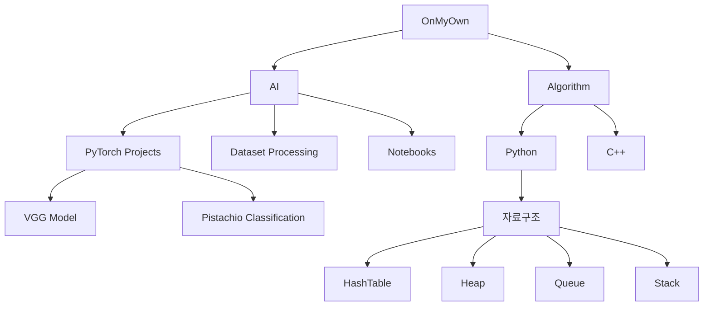
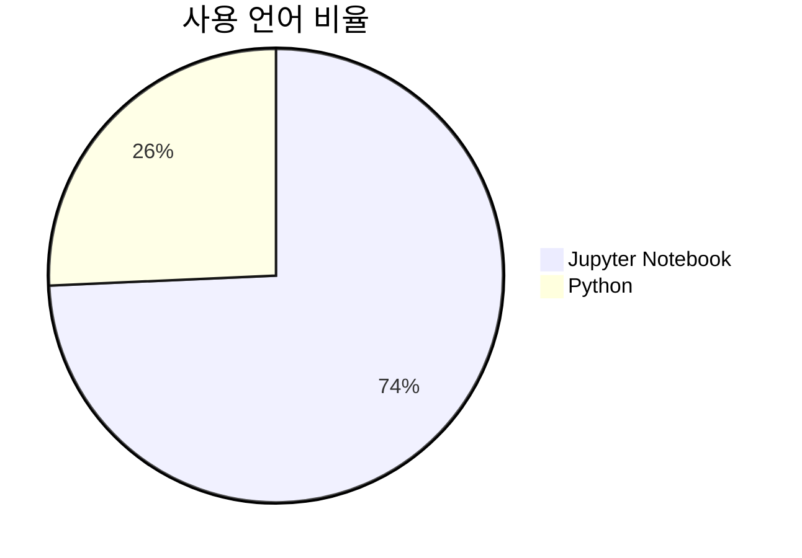
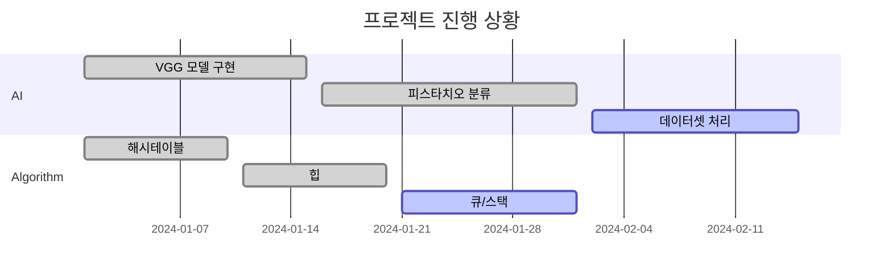

# OnMyOwn

개인 학습을 위한 저장소입니다.

## 🎯 프로젝트 구조


## 📚 학습 내용

### AI
딥러닝과 머신러닝 관련 학습 프로젝트들이 포함되어 있습니다.

#### PyTorch 프로젝트
- VGG 모델 구현 및 테스트
- KNN 알고리즘 구현
- 데이터셋 처리 및 모델링

#### 주요 프로젝트
- 피스타치오 분류 모델 (pistachio.py, pistachio_torch.py)
- 토치 기본 학습 (torchbase.ipynb)
- 데이터셋 처리 (dataset.py, dataset3.py, dataset4.py)

### Algorithm
알고리즘 문제 풀이와 자료구조 구현을 포함합니다.

#### 구현된 자료구조
- 해시테이블 (HashTable)
- 힙 (Heap)
- 큐 (Queue)
- 스택 (Stack)

#### 사용 언어
- Python
- C++

## 🔧 기술 스택


- Python
- PyTorch
- Jupyter Notebook
- C++

## 📊 레포지토리 구조
```
├── AI/
│   ├── vgg_model 관련 파일
│   ├── dataset 처리 파일
│   ├── *.ipynb (Jupyter Notebook 학습 파일)
│   └── 기타 ML/DL 구현 파일
│
├── algorithm/
│   ├── python/
│   │   ├── hashtable/
│   │   ├── heap/
│   │   ├── queue/
│   │   └── stack/
│   └── c++/
└── .vscode/         # VS Code 설정 파일
```

## 📝 학습 목표
- AI/ML 프로젝트 실습을 통한 실전 경험 축적
- 다양한 자료구조와 알고리즘의 구현 및 이해
- PyTorch를 활용한 딥러닝 모델 구현 능력 향상
- 효율적인 코드 작성과 최적화 학습

## 📈 진행 상황


---
⭐ 지속적으로 업데이트되는 개인 학습 저장소입니다.